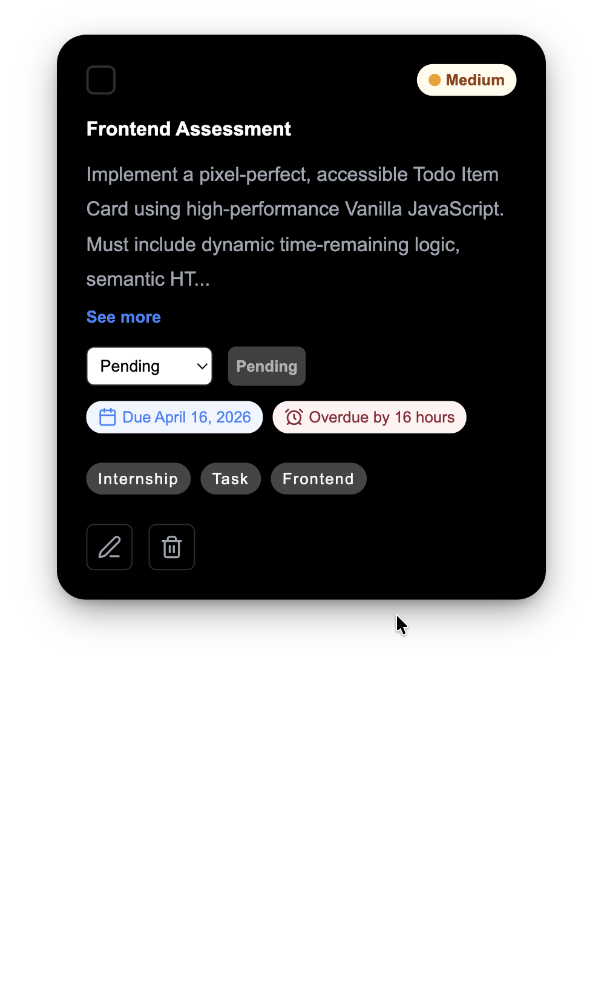
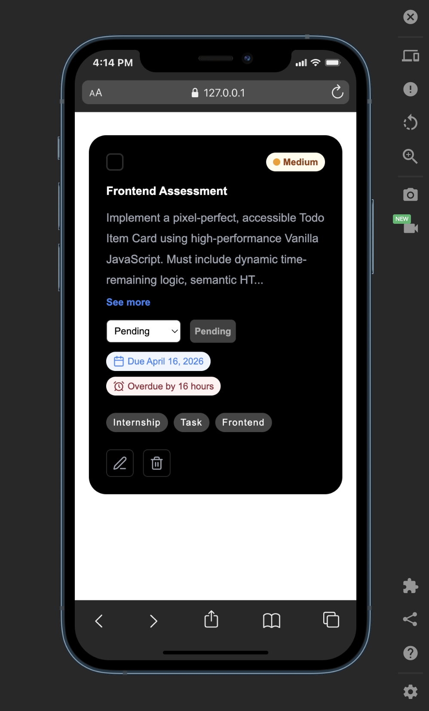
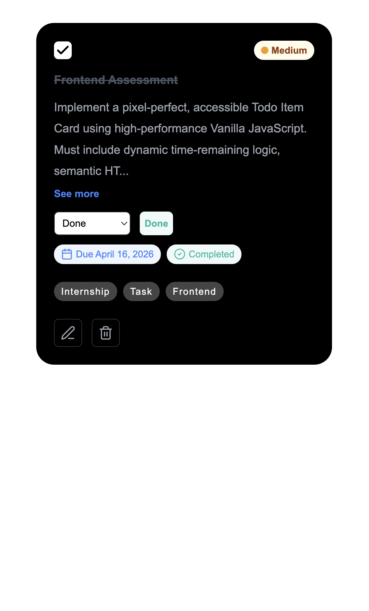
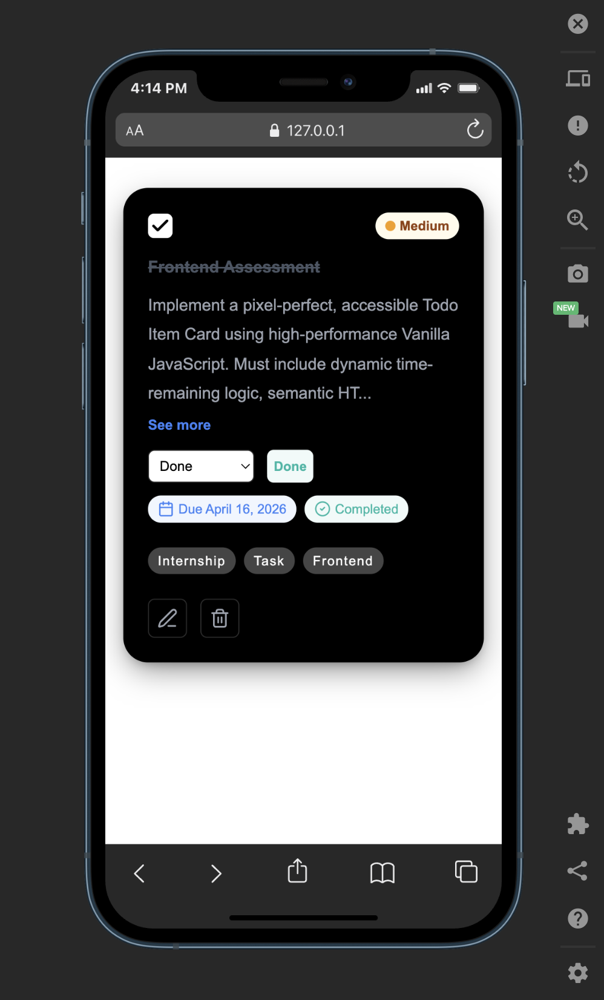
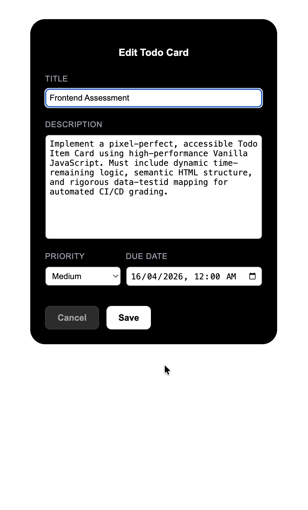
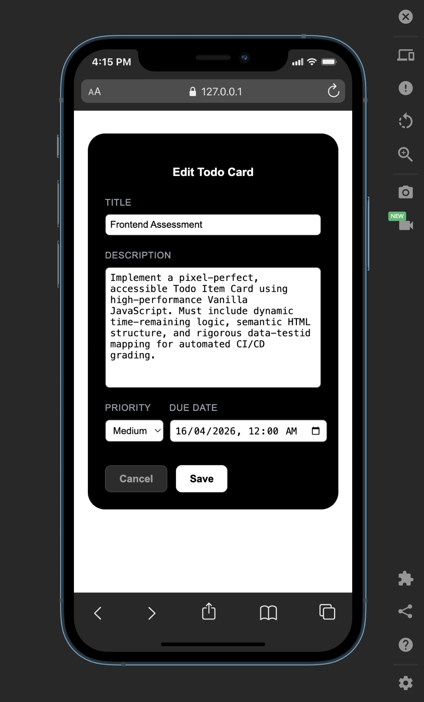

# Task Pro Card

A high-performance, pixel-perfect Todo Item Card built with Vanilla JavaScript and semantic HTML. This project was developed as a fulfillment of the HNG Internship task requirement, focusing on accessibility, dynamic time-logic, and rigorous data-testid mapping.

## Live Demo

[View Live Demo](https://task-pro-card-cr8tivedav.vercel.app/)

### Visual States & Responsiveness

| State         |                         Desktop Preview                          |                           Mobile Preview                           |
| :------------ | :--------------------------------------------------------------: | :----------------------------------------------------------------: |
| **Unchecked** |  |  |
| **Checked**   |  |  |
| **Edit**      |     |     |

## Features

- **Pixel-Perfect Design:** A dark-themed pixel-perfect task card using modern CSS.
- **Dynamic State Management:** Real-time visual updates (strike-through and status badge toggling) when a task is completed.
- **Time-Remaining Logic:** Automated calculation of deadlines relative to the current date.

- **Focus Management:** When entering edit mode, focus is programmatically moved to the title input. Upon canceling or saving, focus is returned to the original Edit button to maintain the user's place in the document flow.

- **Accessibility First:** Semantic HTML structure, ARIA-live regions for dynamic content, ARIA-label, and full keyboard navigation support.

- **CI/CD:** Complete mapping of data-testid attributes for automated grading and testing.

## 1. Interactive Editing Mode

The card now supports a dedicated editing state. Clicking the edit action swaps the view-only display for a validated form.

- **Fields:** Supports updates for title, description, priority levels, and due dates.

- **Validation:** The save operation is blocked if the title or description fields are empty, with error messages displayed dynamically.

- **State Persistence:** Saving updates the card values globally, while canceling restores the previous state and returns focus to the trigger element.

## Known Limitations

- **State management:** The card is partially uses the localStorage and local DOM to manage and persist state across the application.

- **Single Instance:** The logic is optimized for a standalone component. To scale to a list view would require a more robust logic and state management.

## Technical Stack

- **HTML5:** Semantic structure (Article, Header, Time).
- **CSS3:** Flexbox layout and responsive design.
- **Vanilla JavaScript:** DOM manipulation and time calculations.
- **Lucide Icons:** Used for consistent, scalable icons.
